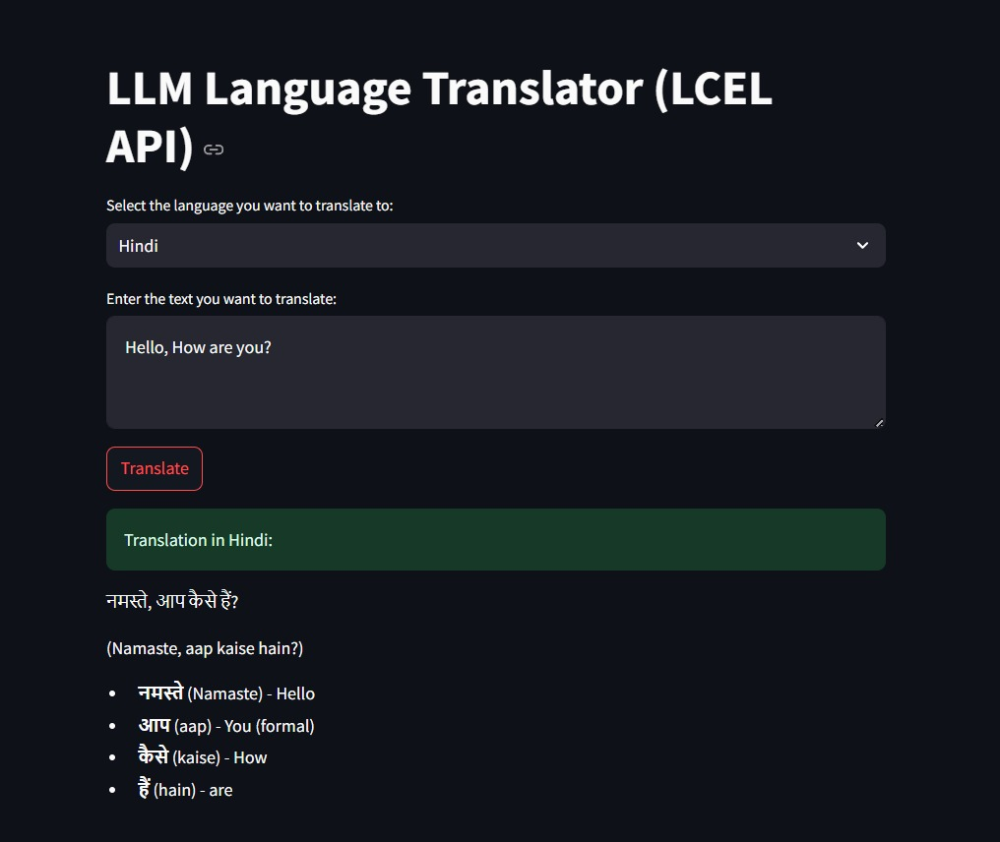
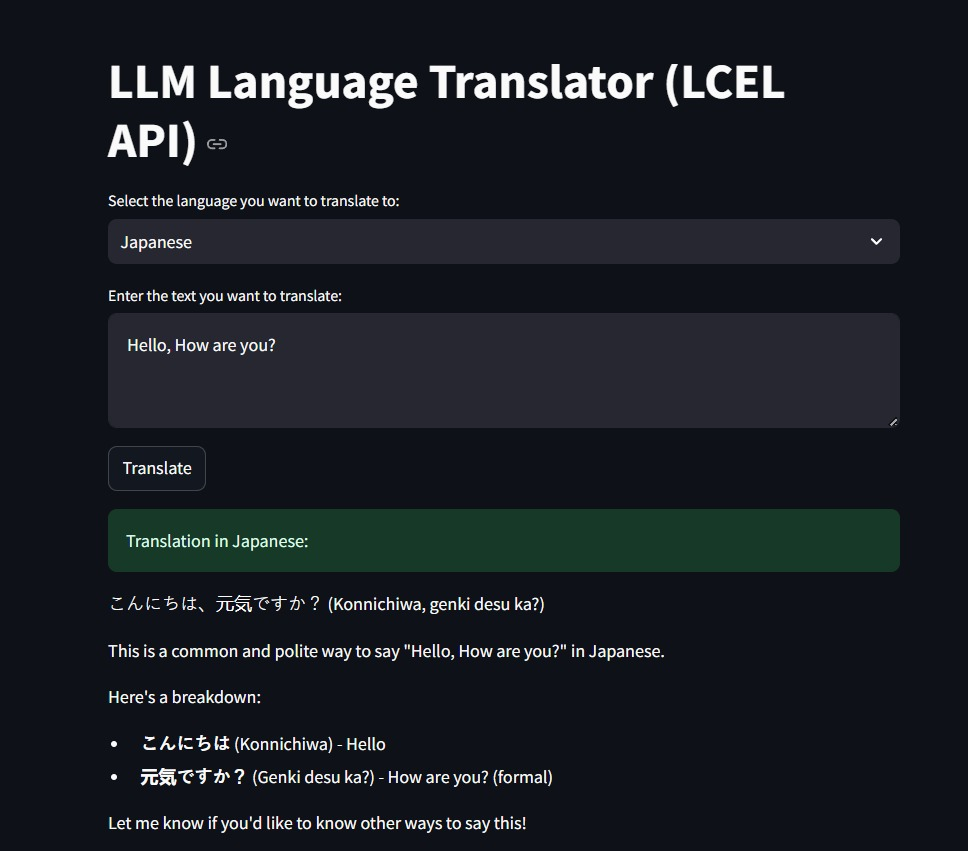

# 🌐 LLM Language Translator App

This is a single-page, full-stack language translation application. The backend is a fast and efficient API built with FastAPI and LangServe, powered by a Large Language Model (LLM) from Groq. The frontend is a user-friendly interface developed with Streamlit.

The application demonstrates a robust architecture for deploying and interacting with LangChain LCEL (LangChain Expression Language) chains, showcasing the low-latency performance of Groq's Llama 3 model.

---

## 🖼️ Application Screenshot

A visual representation of the app's user interface is provided below. You can replace this placeholder with a screenshot of your running application.





---

## ✨ Features

- **Backend API**: A REST API built with FastAPI and LangServe that exposes a simple LCEL chain for text translation.
- **Dynamic Language Translation**: The API translates input text into a user-specified language.
- **Fast Inference**: Leverages Groq's high-speed LPU to provide near-instant translation responses, which is ideal for real-time applications.
- **Frontend UI**: A clean, interactive user interface built with Streamlit for a great user experience.
- **Clear Separation of Concerns**: The project is structured into `serve.py` (API logic) and `client.py` (UI logic), demonstrating a modern MVT (Model-View-Template) style architecture.

---

## 🚀 Setup and Installation

Follow these steps to get the application running on your local machine.

### 1. Clone the Repository
First, clone this repository to your local machine using Git.

```bash
git clone https://github.com/your-username/LLM-Language-Translator-LCEL-API-.git
cd LLM-Language-Translator-LCEL-API-
```

### 2. Create and Activate a Virtual Environment
It's highly recommended to use a Python virtual environment to manage dependencies.

```bash
# Create a new virtual environment
python -m venv venv

# Activate the virtual environment
# On Windows:
.\venv\Scripts\activate
# On macOS/Linux:
source venv/bin/activate
```

### 3. Install Dependencies
Install all the required Python libraries. This project uses specific versions to ensure compatibility between langserve, fastapi, and pydantic.

```bash
pip install --upgrade pip
pip install "pydantic<2" "fastapi==0.100.0" "langserve==0.2.2" "httpx==0.27.0" streamlit langchain-groq python-dotenv
```

### 4. Configure Your API Key
This application requires an API key from Groq to access their models.

- Sign up for a free account on the Groq Console.
- Navigate to the **API Keys** section and create a new key. Copy it immediately.
- Create a file named `.env` in the root directory of your project.
- Add your Groq API key to the file like this:

```
GROQ_API_KEY="gsk_your_api_key_here"
```

---

## ▶️ How to Run the App

This application consists of two parts that must be run in separate terminal windows.

### Step 1: Run the Backend API Server
In your first terminal, navigate to the project directory and run the `serve.py` file. This starts the LangServe API.

```bash
python serve.py
```

You should see a message confirming that the Uvicorn server is running on `http://127.0.0.1:8000`.

### Step 2: Run the Frontend Streamlit App
In a second terminal window, also in the project directory, run the Streamlit application.

```bash
streamlit run client.py
```

This will open a new tab in your web browser with the interactive application. You can now enter text, select a language from the dropdown, and see the translated result.

---

## 📁 Project Structure

```
.
├── client.py
├── serve.py
├── .env
├── README.md
└── requirements.txt  
```

> **Note**: For future reference, you can create a `requirements.txt` file by running:
> ```bash
> pip freeze > requirements.txt
> ```
This is a best practice for sharing your project and ensuring others can replicate your exact environment.
